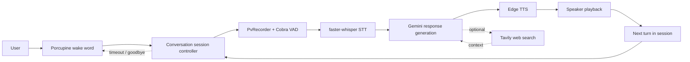
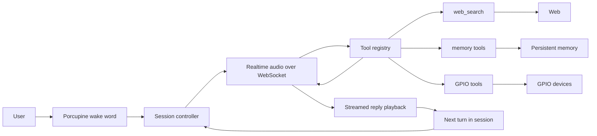
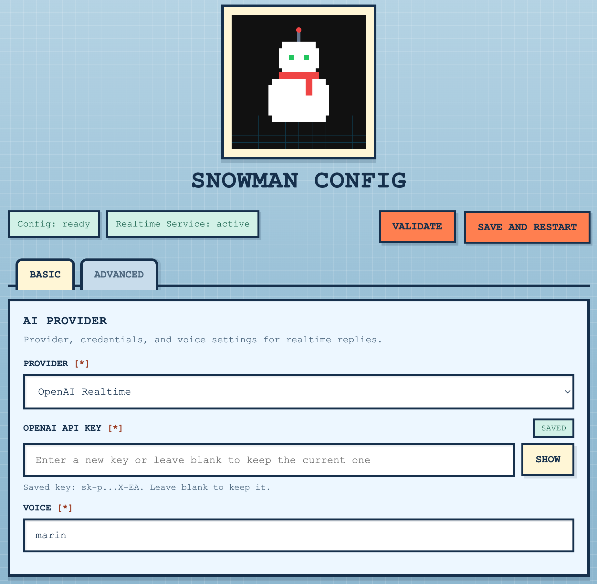

<div align="center">
  
  <h1>Snowman</h1>
  <p><strong>The Home Voice Agent for Raspberry Pi</strong></p>
</div>

---

Snowman now has two separate apps:

- `pipeline/`: the existing local-first assistant, frozen as a baseline
- `realtime/`: a new OpenAI Realtime API version for Raspberry Pi voice-agent work

## Pipeline vs Realtime

### Design Difference

- `pipeline/` is a classic custom pipelined stack: wake word, VAD, STT, LLM, and TTS are stitched together..
- `realtime/` is a realtime speech-to-speech voice agent: the Pi handles wake word detection and audio playback, while the live conversation runs through a realtime speech session via websocket. Tool use and memory are also equipped.

### Tradeoffs

| App | Strengths | Weaknesses |
| --- | --- | --- |
| `pipeline/` | Lower cost and easier to run as a baseline | Noticeably higher latency, with weaker non-English STT performance |
| `realtime/` | Better overall responsiveness and a more natural voice experience | More expensive for heavy use |

### Which One To Choose

- Choose `pipeline/` for cost-sensitive usage, debugging, benchmarking, or as a fallback when you want tighter control over each stage of the stack.
- Choose `realtime/` for the primary home voice-agent experience, especially when low latency, more natural turn-taking, and future tool / memory / device-control features matter more than cost.

## Pipeline App

The original app was moved intact into [`pipeline/`](./pipeline/README.md). It remains the fallback and comparison target while the new realtime path is developed.

### Components

- Porcupine wake word detection
- Cobra VAD
- faster-whisper STT
- LLM for response generation
- Edge TTS
- Tavily search

### Architecture



## Realtime App

The new app lives in [`realtime/`](./realtime/README.md). 

### Components

- Porcupine for wake word detection 
- realtime speech-to-speech via websocket (OpenAI realtime API /  Gemini Live API)
- Tools: web search, memory search / update, and GPIO operation, etc.

### Architecture



It is designed to run on the Raspberry Pi hardware that is already connected and reachable over SSH.

### First Install and Configuration On Pi

On a fresh Raspberry Pi, run:

```bash
curl -O https://raw.githubusercontent.com/herrkaefer/snowman/main/install-snowman.sh
bash install-snowman.sh --target realtime
```

The installer will:

- install system dependencies
- clone the repo to `~/voice-assistant-realtime`
- install the realtime services
- start the config UI on port `3010`

### Access the Config UI

The config UI runs as the always-on `snowman-config-ui.service`, so you can reopen it later any time to change settings.

<div align="center">
  
</div>

Open it from another device on the same network:

- `http://<pi-ip>:3010`
- or, if local hostname resolution works on your network, `http://raspberrypi.local:3010`

To find the current Pi IP, run:

```bash
hostname -I
```

Then fill in the required fields and click `Save And Restart`.
