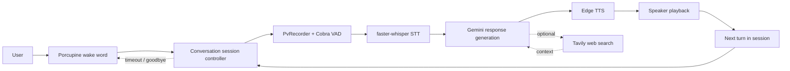
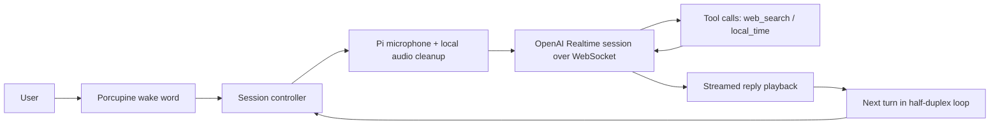

# Snowman

Snowman now has two separate apps:

- `pipeline/`: the existing local-first assistant, frozen as a baseline
- `realtime/`: a new OpenAI Realtime API version for Raspberry Pi voice-agent work

## Layout

```text
snowman/
├── pipeline/
├── realtime/
└── plans/
```

## Custom Pipeline App

The original app was moved intact into [`pipeline/`](./pipeline/README.md). It remains the fallback and comparison target while the new realtime path is developed.



## Realtime App

The new app lives in [`realtime/`](./realtime/README.md). Its v1 architecture is:



It is designed to run on the Raspberry Pi hardware that is already connected and reachable over SSH.
