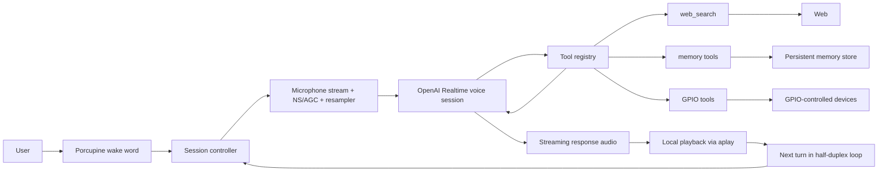

# Snowman Realtime

OpenAI Realtime API based voice assistant for Raspberry Pi.

## Goals

- Keep the custom pipeline app untouched in `../custom_pipeline/`
- Run on Raspberry Pi as a thin audio client
- Use local Porcupine wake word detection
- Stream audio directly to OpenAI Realtime over WebSocket
- Play model audio responses immediately
- Use explicit local turns and half-duplex turn-taking

## Architecture



## Setup

Preferred one-command deploy on Raspberry Pi:

```bash
./realtime/deploy.sh --host <pi_hostname/ip> --user <username> [--port 22] [--env-file realtime/.env]
```

This script handles both first install and later redeploys. It syncs the app to `/home/<user>/voice-assistant-realtime/realtime`, refreshes the virtualenv, installs the parameterized systemd units, enables `snowman-realtime.service` and `snowman-realtime-healthcheck.timer`, and restarts the main service.

1. Create and activate a virtual environment:

```bash
cd realtime
python3 -m venv venv
source venv/bin/activate
```

2. Install dependencies:

```bash
pip install -r requirements.txt
```

3. Create `.env` from the example:

```bash
cp .env.example .env
```

4. Fill in:

- `OPENAI_API_KEY`
- `PORCUPINE_ACCESS_KEY`
- audio and wake-word settings if needed
- `WAKE_WORD_SENSITIVITY` defaults to `0.5`; raise it carefully if wake-word interrupt misses during playback
- `SYSTEM_PROMPT` is not required in `.env`; the default assistant prompt now lives in code and is augmented at runtime with the current local date/time and current-information tool rules

## Run

```bash
./start_realtime.sh
```

This wrapper kills any older `main.py` instance first, then starts exactly one foreground process.

For routine use on Raspberry Pi, prefer the systemd service instead of manual `nohup`.

To bypass the wake word and repeatedly trigger turns automatically for debugging, set:

```bash
AUTO_TRIGGER_ENABLED=true
AUTO_TRIGGER_INTERVAL_SECONDS=0.0
AUTO_TRIGGER_MAX_SESSIONS=0
```

With that mode enabled, the app enters each turn directly and records the next utterance without waiting for `Snowman`.

To make that mode fully automated for connection testing, also enable synthetic utterances:

```bash
AUTO_TRIGGER_USE_SYNTHETIC_AUDIO=true
AUTO_TRIGGER_SYNTHETIC_AUDIO_MS=2500
```

## Current Behavior

- The app supports single-turn mode when `SESSION_WINDOW_ENABLED=false`.
- The app supports short multi-turn session-window mode when `SESSION_WINDOW_ENABLED=true`.
- The current interaction model is half-duplex: the assistant listens for one turn, replies, then waits for the next turn.
- In session-window mode, one wake word opens one Realtime session and keeps it alive across short follow-up turns.
- The microphone is still locally gated per turn; it does not stay continuously open during reply playback.
- Reply playback is not treated as interruptible; the next turn begins after the current reply finishes.
- Each Realtime session and each response now receive dynamic prompt context with the current local date/time on the Raspberry Pi.
- Optional fixed Raspberry Pi location can also be injected into the runtime prompt for local-context questions such as weather, nearby places, and commute.
- For current or changing facts such as officeholders, news, weather, prices, laws, schedules, and anything phrased as current/latest/today/now/recent, the assistant is instructed to call `web_search` before answering instead of relying on memory.
- Ordinary date/time questions can usually be answered directly from the injected current timestamp; `local_time` remains available as a fallback for precise current-time checks in longer sessions.
- When location is configured, the same city/region/country/timezone is also passed to `web_search` as approximate user location.

Common session-window settings:

- `SESSION_WINDOW_ENABLED=false` keeps the original single-turn flow
- `SESSION_FOLLOWUP_TIMEOUT=6.0` controls how long follow-up turns wait for speech
- `SESSION_MAX_TURNS=0` means unlimited turns until timeout or end phrase
- `POST_REPLY_CUE_PATH=ready_cue.wav` replays the ready cue after each completed reply by default

Optional fixed location settings:

- `LOCATION_CITY=Chicago`
- `LOCATION_REGION=IL`
- `LOCATION_COUNTRY_CODE=US`
- `LOCATION_TIMEZONE=America/Chicago`

## Probe Realtime Connectivity

Use the probe script to isolate Realtime connection reliability from the microphone pipeline:

```bash
python probe_realtime_connect.py --attempts 20
```

To test the next stage as well, including synthetic audio upload and response creation:

```bash
python probe_realtime_connect.py --attempts 20 --with-audio
```

To approximate the current app's upload style more closely, use chunked upload:

```bash
python probe_realtime_connect.py --attempts 20 --with-audio --audio-ms 2500 --upload-mode chunked-burst
```

To compare against a paced upload variant:

```bash
python probe_realtime_connect.py --attempts 20 --with-audio --audio-ms 2500 --upload-mode chunked-paced
```

## Raspberry Pi Notes

- The default playback path uses `aplay` with raw PCM.
- Wake word detection still uses a local `.ppn` file.
- Wake word sensitivity is controlled by `WAKE_WORD_SENSITIVITY` in the range `0.0` to `1.0`; higher values reduce misses but increase false triggers.
- The default custom wake word path points to `Snowman_en_raspberry-pi_v4_0_0.ppn` in this directory.
- The default ready cue uses `ready_cue.wav` in this directory.
- A post-reply cue can be configured with `POST_REPLY_CUE_PATH`; by default it reuses `ready_cue.wav`.
- A failure cue can be configured with `FAILURE_CUE_PATH`; by default it uses `wake_chime.wav`.
- The default playback device is auto-detected and prefers `Google voiceHAT`.
- The default prompt lives in `snowman_realtime/config.py`; use `.env` overrides only if you intentionally want a custom prompt.
- The default mode uses manual turn submission to Realtime instead of continuous server VAD.
- The product interaction model is currently half-duplex rather than true barge-in during reply playback.
- Model reply playback is software-attenuated with `OUTPUT_GAIN` to reduce speaker feedback on Raspberry Pi.
- Optional local input cleanup can be enabled with `INPUT_NS_ENABLED` and `INPUT_AGC_ENABLED`.
- The current `NS/AGC` path is lightweight local preprocessing designed to be safe on Raspberry Pi and easy to disable if it hurts recognition.
- Direct Realtime tools currently include `web_search` for current information and `local_time` for exact current local time.
- `web_search` uses `WEB_SEARCH_MODEL`, which now defaults to `gpt-5.2`.
- Realtime connection/setup now uses configurable timeouts and exponential retry backoff, with three total attempts by default.

## Current Hardware Config

Current Raspberry Pi setup being tested:

- Pi: `Raspberry Pi 5 Model B Rev 1.1`
- Mic / speaker HAT: `Google voiceHAT SoundCard HiFi`
- ALSA capture card: `snd_rpi_googlevoicehat_soundcar`
- Input device index: `12`
- Playback device: `plughw:2,0`
- Wake word model: `Snowman_en_raspberry-pi_v4_0_0.ppn`
- Wake word sensitivity: `0.75`
- Voice: `shimmer`
- Session window: `enabled`
- Local input cleanup: `INPUT_NS_ENABLED=true`, `INPUT_AGC_ENABLED=true`
- Current reply output gain: `0.13`

Current known limitation on this hardware:

- True wake-word interrupt during reply playback is not currently a supported interaction mode on this `voiceHAT` setup.
- Lowering `OUTPUT_GAIN` reduces playback leakage into the microphone, but has not produced a reliable interrupt path.
- For now, the intended user experience should be treated as half-duplex turn-taking rather than barge-in.

## Service

The Raspberry Pi deployment now uses:

- `snowman-realtime.service`
- `snowman-realtime-healthcheck.service`
- `snowman-realtime-healthcheck.timer`
- `snowman-realtime-window-start.service`
- `snowman-realtime-window-start.timer`
- `snowman-realtime-window-stop.service`
- `snowman-realtime-window-stop.timer`

The main service uses `start_realtime.sh`, so every restart also cleans up any older leftover instance before starting a new one.

### Install On Raspberry Pi

Copy these files to the Pi and install them as system services:

```bash
sudo install -m 644 snowman-realtime.service /etc/systemd/system/snowman-realtime.service
sudo install -m 644 snowman-realtime-healthcheck.service /etc/systemd/system/snowman-realtime-healthcheck.service
sudo install -m 644 snowman-realtime-healthcheck.timer /etc/systemd/system/snowman-realtime-healthcheck.timer
sudo install -m 755 check_realtime_health.sh /home/snowman/voice-assistant-realtime/realtime/check_realtime_health.sh
sudo install -m 755 within_runtime_window.sh /home/snowman/voice-assistant-realtime/realtime/within_runtime_window.sh
sudo systemctl daemon-reload
sudo systemctl enable --now snowman-realtime.service
sudo systemctl enable --now snowman-realtime-healthcheck.timer
```

### Schedule A Daily Runtime Window

If you want the assistant to run only during a fixed local-time window, for example `07:30` to `21:30`, install these extra units:

```bash
sudo install -m 644 snowman-realtime-window-start.service /etc/systemd/system/snowman-realtime-window-start.service
sudo install -m 644 snowman-realtime-window-start.timer /etc/systemd/system/snowman-realtime-window-start.timer
sudo install -m 644 snowman-realtime-window-stop.service /etc/systemd/system/snowman-realtime-window-stop.service
sudo install -m 644 snowman-realtime-window-stop.timer /etc/systemd/system/snowman-realtime-window-stop.timer
sudo install -m 755 within_runtime_window.sh /home/snowman/voice-assistant-realtime/realtime/within_runtime_window.sh
sudo systemctl daemon-reload
```

Then switch away from always-on boot startup:

```bash
sudo systemctl disable --now snowman-realtime.service
sudo systemctl disable --now snowman-realtime-healthcheck.timer
sudo systemctl enable --now snowman-realtime-window-start.timer
sudo systemctl enable --now snowman-realtime-window-stop.timer
```

How it works:

- `07:30`: start `snowman-realtime.service` and `snowman-realtime-healthcheck.timer`
- `21:30`: stop the health-check timer first, then stop the main realtime service
- outside that window, `within_runtime_window.sh` reads the installed start/stop timers and blocks both service restarts and health-check restarts

The timers use Raspberry Pi local time and set `Persistent=true`, so if the Pi reboots and missed one of the scheduled times, systemd will catch up on the next boot.

To change the schedule, edit these timer files and reinstall them. They are the single source of truth for the allowed runtime window:

- `snowman-realtime-window-start.timer`: `OnCalendar=*-*-* 07:30:00`
- `snowman-realtime-window-stop.timer`: `OnCalendar=*-*-* 21:30:00`

Useful checks:

```bash
sudo systemctl list-timers --all | grep 'snowman-realtime-window'
sudo systemctl status snowman-realtime-window-start.timer --no-pager
sudo systemctl status snowman-realtime-window-stop.timer --no-pager
```

### Daily Operations

Use these commands on Raspberry Pi:

```bash
sudo systemctl start snowman-realtime
sudo systemctl stop snowman-realtime
sudo systemctl restart snowman-realtime
sudo systemctl status snowman-realtime --no-pager
tail -f ~/voice-assistant-realtime/realtime/realtime.log
```

To verify only one realtime instance is running:

```bash
pgrep -af "voice-assistant-realtime/realtime/main.py"
```

### Health Check

The app now emits a periodic `Health heartbeat:` log line by default.

The health-check timer runs every 2 minutes and restarts the main service if any of these happen:

- the systemd service is not active
- the process count is not exactly one
- the latest heartbeat is older than 5 minutes

Manual health-check commands:

```bash
sudo systemctl status snowman-realtime-healthcheck.timer --no-pager
sudo systemctl start snowman-realtime-healthcheck.service
journalctl -u snowman-realtime-healthcheck.service -n 20 --no-pager
```

### Testing Without Creating Multiple Instances

For normal testing on Raspberry Pi:

- use `sudo systemctl restart snowman-realtime`
- do not start a separate `nohup ./start_realtime.sh`
- if you need to play standalone audio samples, stop the service first and start it again after the sample playback
