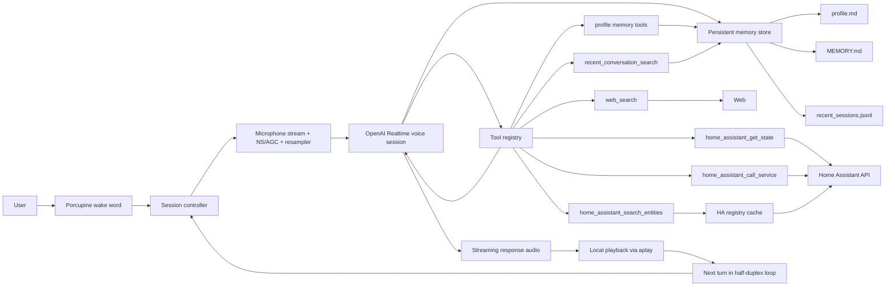

# Snowman Realtime

OpenAI Realtime API based voice assistant for Raspberry Pi.

## Current Layout

The current self-hosted install layout is:

- app code: `~/snowman-realtime/realtime`
- persistent config and secrets: `~/snowman-realtime/data/config.json`, `~/snowman-realtime/data/secrets.json`
- editable agent identity prompt: `~/snowman-realtime/data/identity.md`
- persistent memory files: `~/snowman-realtime/data/memory/`

Current memory files:

- `profile.md`: editable long-lived profile memory
- `MEMORY.md`: generated memory index injected into the runtime prompt
- `profile.baseline.md`: manual restore point for profile recovery
- `recent_sessions.jsonl`: compact recent conversation summaries, newest sessions available in the Config UI `Conversations` tab and to the runtime `recent_conversation_search` tool

## Recent Updates

- Prompt storage moved out of `config.json` and into `data/identity.md`.
- Memory storage moved out of `realtime/state/memory` and into `data/memory`.
- The Raspberry Pi install directory is now `~/snowman-realtime` instead of `~/voice-assistant-realtime`.
- The `Tools` tab now supports tool-specific configuration.
- `web_search` is the first configurable tool and now stores its model under `tool_config.web_search.model` in `data/config.json`.
- Home Assistant now uses explicit tools for search, get-state, and call-service, with HA URL stored in tool config and the access token stored in `data/secrets.json`.
- The Config UI `Tools` tab can `Verify & Sync` Home Assistant and cache area/device/entity registry data under `data/home_assistant/registry_snapshot.json`.

## Goals

- Keep the custom pipeline app untouched in `../pipeline/`
- Run on Raspberry Pi as a thin audio client
- Use local Porcupine wake word detection
- Stream audio directly to OpenAI Realtime over WebSocket
- Play model audio responses immediately
- Use explicit local turns and half-duplex turn-taking

## Architecture



## Setup

Preferred one-command deploy on Raspberry Pi:

```bash
./realtime/scripts/deploy.sh --host <pi_hostname/ip> --user <username> [--port 22]
```

This script handles both first install and later redeploys. It syncs the app to `/home/<user>/snowman-realtime/realtime`, refreshes the virtualenv, installs the parameterized systemd units, migrates legacy realtime `.env` values into `data/config.json` and `data/secrets.json`, enables `snowman-realtime.service` and `snowman-realtime-healthcheck.timer`, and restarts the main service.

For first install and web-based configuration on Raspberry Pi, see the root [`README.md`](../README.md).

Directory layout:

- `audio/` stores tracked cue and loop WAV assets
- `scripts/` stores deploy, runtime, and probe scripts
- `systemd/` stores deployable unit and timer files
- `tests/` stores local test utilities and unit tests

For local development:

1. Create and activate a virtual environment:

```bash
cd realtime
python3 -m venv venv
source venv/bin/activate
```

2. Install dependencies:

```bash
pip install -r requirements.txt
```

3. Start the config UI:

```bash
./scripts/start_config_ui.sh
```

4. Open the UI in a browser:

```text
http://<pi-ip>:3010
```

5. Fill in the Basic tab:

- OpenAI API key
- realtime model
- Porcupine access key
- voice assistant name
- voice
- system prompt
- optional wake-word model, wake-word sensitivity, and location settings

6. Use the Advanced tab if you need to tune audio devices, turn timing, retries, or health checks.

All runtime settings now come from `data/config.json`, `data/secrets.json`, `data/identity.md`, and `data/memory/`. The old `.env` workflow is no longer used.

## Run

```bash
./scripts/start_realtime.sh
```

This wrapper kills any older `python3 -m snowman_realtime` instance first, then starts exactly one foreground process.

For routine use on Raspberry Pi, prefer the systemd service instead of manual `nohup`.

To bypass the wake word and repeatedly trigger turns automatically for debugging, set these keys in the Advanced tab JSON:

```json
{
  "auto_trigger_enabled": true,
  "auto_trigger_interval_seconds": 0.0,
  "auto_trigger_max_sessions": 0
}
```

With that mode enabled, the app enters each turn directly and records the next utterance without waiting for `Snowman`.

To make that mode fully automated for connection testing, also enable synthetic utterances in the Advanced tab:

```json
{
  "auto_trigger_use_synthetic_audio": true,
  "auto_trigger_synthetic_audio_ms": 2500
}
```

## Current Behavior

- The app runs in multi-turn conversation mode by default.
- The current interaction model is half-duplex: the assistant listens for one turn, replies, then waits for the next turn.
- One wake word opens one Realtime session and keeps it alive across short follow-up turns.
- The microphone is still locally gated per turn; it does not stay continuously open during reply playback.
- Reply playback is not treated as interruptible; the next turn begins after the current reply finishes.
- Each Realtime session and each response now receive dynamic prompt context with the current local date/time on the Raspberry Pi.
- Optional fixed Raspberry Pi location can also be injected into the runtime prompt for local-context questions such as weather, nearby places, and commute.
- For current or changing facts such as officeholders, news, weather, prices, laws, schedules, and anything phrased as current/latest/today/now/recent, the assistant is instructed to call `web_search` before answering instead of relying on memory.
- For recent cross-session recall such as what was discussed earlier, recently, or about a prior topic, the assistant is instructed to call `recent_conversation_search` instead of guessing from profile memory.
- Recent conversation summaries are written automatically after each completed session and retained in `recent_sessions.jsonl` with newest-first display in the Config UI.
- Ordinary date/time questions can usually be answered directly from the injected current timestamp; `local_time` remains available as a fallback for precise current-time checks in longer sessions.
- When location is configured, the same city/region/country/timezone is also passed to `web_search` as approximate user location.
- For Home Assistant requests, the assistant is instructed to:
  - use `home_assistant_search_entities` to discover likely entities
  - use `home_assistant_get_state` for current state reads
  - use `home_assistant_call_service` for actions with explicit `domain`, `service`, and `entity_id` / `area_id`

Common multi-turn settings in Advanced JSON:

- `session_followup_timeout: 6.0` controls how long follow-up turns wait for speech
- `session_max_turns: 0` means unlimited turns until timeout or end phrase
- `post_reply_cue_path: "audio/ready_cue.wav"` replays the ready cue after each completed reply by default

Optional fixed location settings in Basic:

- `location_city: "Chicago"`
- `location_region: "IL"`
- `location_country_code: "US"`
- `location_timezone: "America/Chicago"`

## Probe Realtime Connectivity

Use the probe script to isolate Realtime connection reliability from the microphone pipeline:

```bash
python scripts/probe_realtime_connect.py --attempts 20
```

To test the next stage as well, including synthetic audio upload and response creation:

```bash
python scripts/probe_realtime_connect.py --attempts 20 --with-audio
```

To approximate the current app's upload style more closely, use chunked upload:

```bash
python scripts/probe_realtime_connect.py --attempts 20 --with-audio --audio-ms 2500 --upload-mode chunked-burst
```

To compare against a paced upload variant:

```bash
python scripts/probe_realtime_connect.py --attempts 20 --with-audio --audio-ms 2500 --upload-mode chunked-paced
```

## Raspberry Pi Notes

- The default playback path uses `aplay` with raw PCM.
- Wake word detection still uses a local `.ppn` file.
- Wake word sensitivity is controlled by the Basic tab field `wake_word_sensitivity` in the range `0.0` to `1.0`; higher values reduce misses but increase false triggers.
- Snowman no longer ships with a default `.ppn` file; users should upload their own custom wake word model from Picovoice Console.
- The default ready cue uses `audio/ready_cue.wav`.
- A post-reply cue can be configured with the Advanced tab key `post_reply_cue_path`; by default it reuses `audio/ready_cue.wav`.
- A failure cue can be configured with the Advanced tab key `failure_cue_path`; by default it uses `audio/wake_chime.wav`.
- The default playback device is auto-detected and prefers `Google voiceHAT`.
- The default prompt lives in `snowman_realtime/config.py`, and the UI writes the active prompt into `data/identity.md`.
- The assistant name is configured separately with `agent_name`; runtime instructions prepend `Your name is {agent_name}.` automatically.
- The default mode uses manual turn submission to Realtime instead of continuous server VAD.
- The product interaction model is currently half-duplex rather than true barge-in during reply playback.
- Model reply playback is software-attenuated with `output_gain` to reduce speaker feedback on Raspberry Pi.
- Optional local input cleanup can be enabled with `input_ns_enabled` and `input_agc_enabled`.
- The current `NS/AGC` path is lightweight local preprocessing designed to be safe on Raspberry Pi and easy to disable if it hurts recognition.
- Direct Realtime tools currently include `web_search` for current information and `local_time` for exact current local time.
- Tool-specific settings now live under `tool_config` in `data/config.json`.
- `web_search` uses `tool_config.web_search.model`, which currently defaults to `gpt-5.2`.
- Realtime connection/setup uses configurable timeouts and retry backoff.

## Service

The Raspberry Pi deployment now uses:

- `snowman-realtime.service`
- `snowman-realtime-healthcheck.service`
- `snowman-realtime-healthcheck.timer`
- `snowman-config-ui.service`

The main service uses `scripts/start_realtime.sh`, so every restart also cleans up any older leftover instance before starting a new one.

### Install On Raspberry Pi

Use `./scripts/deploy.sh` for normal installation and redeploys. The always-on service files in `systemd/` are templates and are rendered by the deploy script with the target user and home directory.

If you only need the optional runtime-window timers, install these extra files manually:

```bash
sudo install -m 644 systemd/snowman-realtime-window-start.service /etc/systemd/system/snowman-realtime-window-start.service
sudo install -m 644 systemd/snowman-realtime-window-start.timer /etc/systemd/system/snowman-realtime-window-start.timer
sudo install -m 644 systemd/snowman-realtime-window-stop.service /etc/systemd/system/snowman-realtime-window-stop.service
sudo install -m 644 systemd/snowman-realtime-window-stop.timer /etc/systemd/system/snowman-realtime-window-stop.timer
sudo install -m 755 scripts/within_runtime_window.sh /home/snowman/snowman-realtime/realtime/scripts/within_runtime_window.sh
sudo systemctl daemon-reload
```

### Schedule A Daily Runtime Window

If you want the assistant to run only during a fixed local-time window, for example `07:30` to `21:30`, install the timer files above, then switch away from always-on boot startup:

Then switch away from always-on boot startup:

```bash
sudo systemctl disable --now snowman-realtime.service
sudo systemctl disable --now snowman-realtime-healthcheck.timer
sudo systemctl enable --now snowman-realtime-window-start.timer
sudo systemctl enable --now snowman-realtime-window-stop.timer
```

How it works:

- `07:30`: start `snowman-realtime.service` and `snowman-realtime-healthcheck.timer`
- `21:30`: stop the health-check timer first, then stop the main realtime service
- outside that window, `scripts/within_runtime_window.sh` reads the installed start/stop timers and blocks both service restarts and health-check restarts

The timers use Raspberry Pi local time and set `Persistent=true`, so if the Pi reboots and missed one of the scheduled times, systemd will catch up on the next boot.

To change the schedule, edit these timer files and reinstall them. They are the single source of truth for the allowed runtime window:

- `snowman-realtime-window-start.timer`: `OnCalendar=*-*-* 07:30:00`
- `snowman-realtime-window-stop.timer`: `OnCalendar=*-*-* 21:30:00`

Useful checks:

```bash
sudo systemctl list-timers --all | grep 'snowman-realtime-window'
sudo systemctl status snowman-realtime-window-start.timer --no-pager
sudo systemctl status snowman-realtime-window-stop.timer --no-pager
```

### Daily Operations

Use these commands on Raspberry Pi:

```bash
sudo systemctl start snowman-realtime.service
sudo systemctl stop snowman-realtime.service
sudo systemctl restart snowman-realtime.service
sudo systemctl status snowman-realtime.service --no-pager
sudo systemctl status snowman-config-ui.service --no-pager
tail -f ~/snowman-realtime/realtime/realtime.log
```

To verify only one realtime instance is running:

```bash
pgrep -af "python3 -u -m snowman_realtime"
```

### Health Check

The app now emits a periodic `Health heartbeat:` log line by default.

The health-check timer runs every 2 minutes and restarts the main service if any of these happen:

- the systemd service is not active
- the process count is not exactly one
- the latest heartbeat is older than 5 minutes

Manual health-check commands:

```bash
sudo systemctl status snowman-realtime-healthcheck.timer --no-pager
sudo systemctl start snowman-realtime-healthcheck.service
journalctl -u snowman-realtime-healthcheck.service -n 20 --no-pager
```

### Testing Without Creating Multiple Instances

For normal testing on Raspberry Pi:

- use `sudo systemctl restart snowman-realtime`
- do not start a separate `nohup ./scripts/start_realtime.sh`
- if you need to play standalone audio samples, stop the service first and start it again after the sample playback
